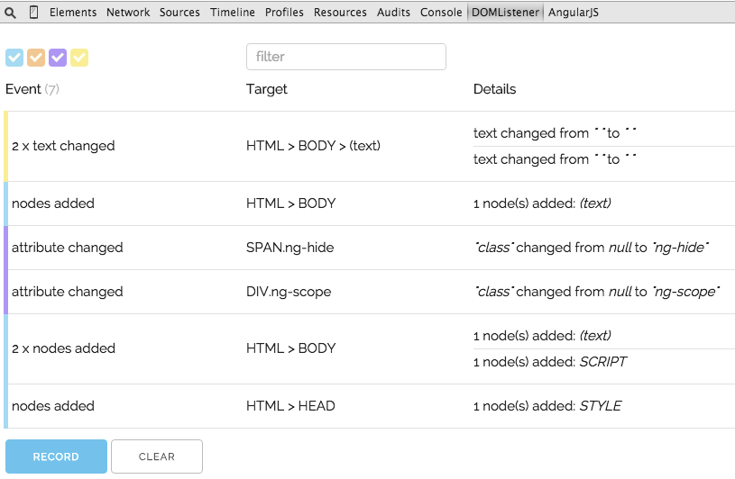

# test-angularjs-directive-execution-order

Results from DOMListener:



## Hot to setup?

0. Install dependencies
    
    ```
    npm install
    ```

1. Install DOMListener - plugin for Google Chrome.
2. Open `app/index.html` in browser.
3. Click `Record` button in DevTools -> DOMListener.

You will see that class `ng-hide` was added.<br />
This CSS class has default styles, they were added when bootstrap was included to page.

---

Full CSS styles included by AngularJS v1.4.4:

```css
@charset "UTF-8";[ng\:cloak],[ng-cloak],[data-ng-cloak],[x-ng-cloak],.ng-cloak,.x-ng-cloak,.ng-hide:not(.ng-hide-animate){display:none !important;}ng\:form{display:block;}.ng-animate-shim{visibility:hidden;}.ng-anchor{position:absolute;}
```
